# Effect of Street Light on Commuting Bats

> **IE501914 - Immersive Technologies** | NTNU M.Sc. ICT-Simulation & Visualization | Semester 3

A VR application that lets lighting designers experience how artificial street light pollution affects the echolocation and commuting behavior of endangered lesser horseshoe bats (*Rhinolophus hipposideros*).

---

## The Problem

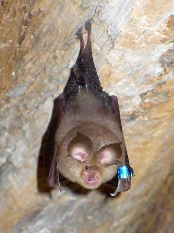

Lesser horseshoe bats (5-9 grams, 19-25 cm) are among the smallest bats in Europe. They rely entirely on echolocation to navigate and hunt — and they rarely fly above 5 meters, making them **uniquely vulnerable to street light pollution**.

Artificial lighting:
- Disrupts their echolocation, making it harder to find food
- Breaks natural day-night cycles affecting feeding and mating
- Forces behavioral changes that can endanger entire populations

This project was inspired by research published in *Current Biology* ([Ref 1](https://www.sciencedirect.com/science/article/pii/S0960982209011932)) studying how *R. hipposideros* commuting patterns are affected by artificial light.

---

## The Solution

A **VR experience built in Unity 3D** and deployed on **Meta Quest 2** that recreates a real Norwegian lakeside environment where users can:

- **Observe** bats commuting through their natural habitat
- **Watch** behavioral changes as bats enter and exit street light zones
- **Teleport** around the scene using VR controllers
- **Experience** the environment from both a bat's perspective and a lighting designer's perspective
- **Add/remove light poles** to understand how lighting decisions impact wildlife

---

## Virtual Environment

### Study Area

Inspired by **Ratvikvatnet**, a freshwater lake in Ålesund, Norway — an active NORDARK project research site.

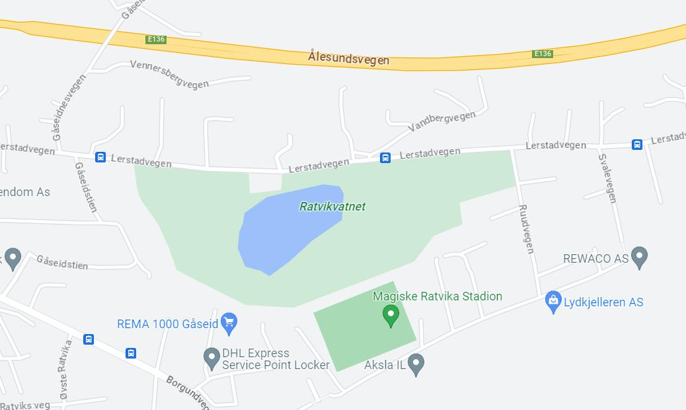

### 3D Scene

A digital replica of the lakeside environment featuring:

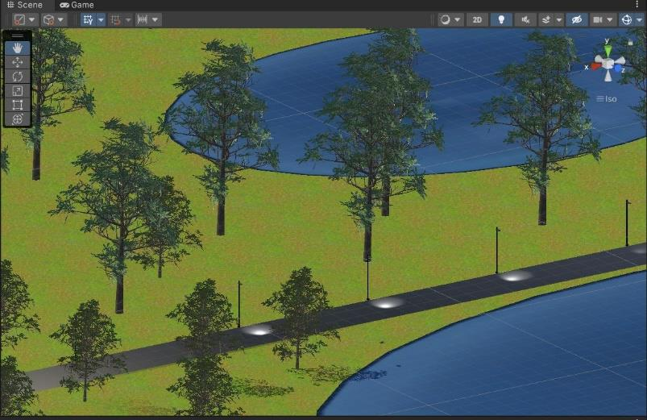

- Terrain with textured ground and water
- Street lights with spotlight cones and 3D colliders
- Trees and vegetation
- Moving bats with flight animations

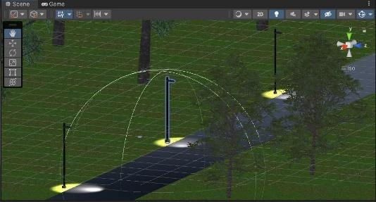

---

## Implementation

### 3D Bat Model

A bat model was created from scratch in Unity with two attached animations:

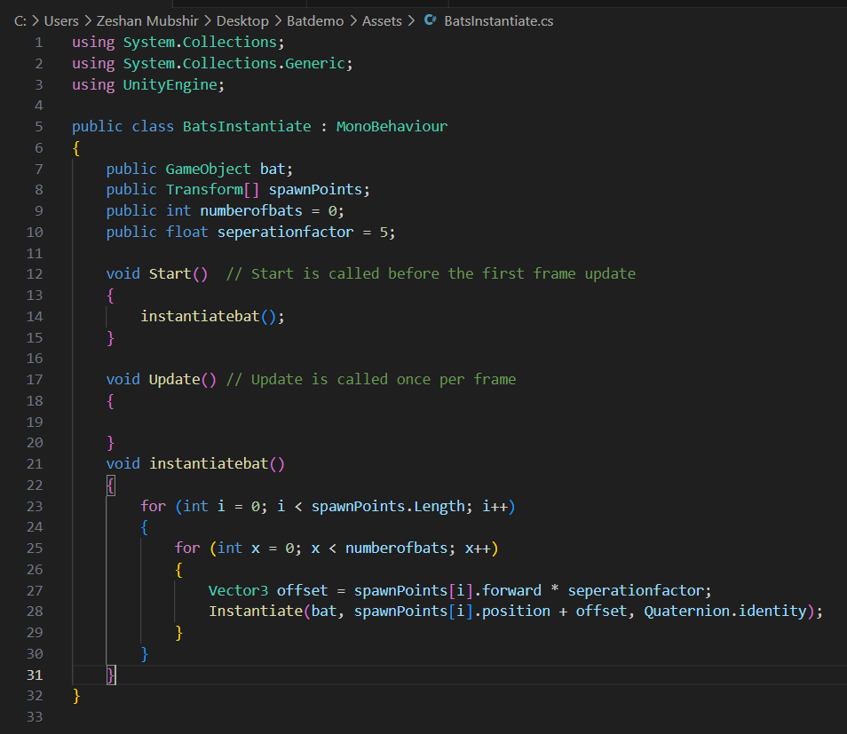

### Animation System

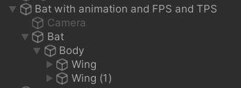

### First & Third Person Views

Every instantiated bat has a camera for FPS and TPS tracking:

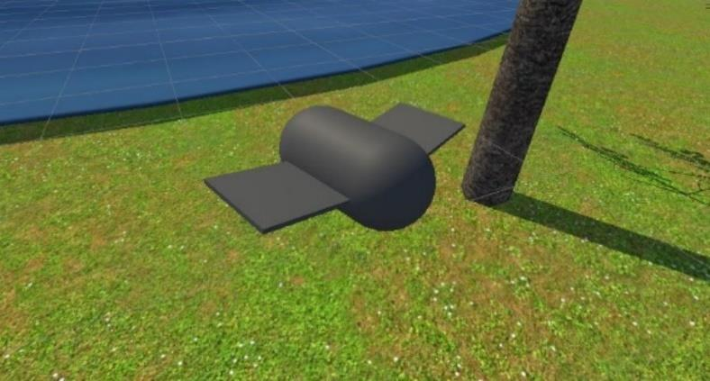

### Bats Instantiation

Bats are spawned at configurable spawn points. The number of bats can be changed at runtime.

### Behavior in Light

A `Behaviourchange.cs` script detects when a bat enters a street light's trigger zone:

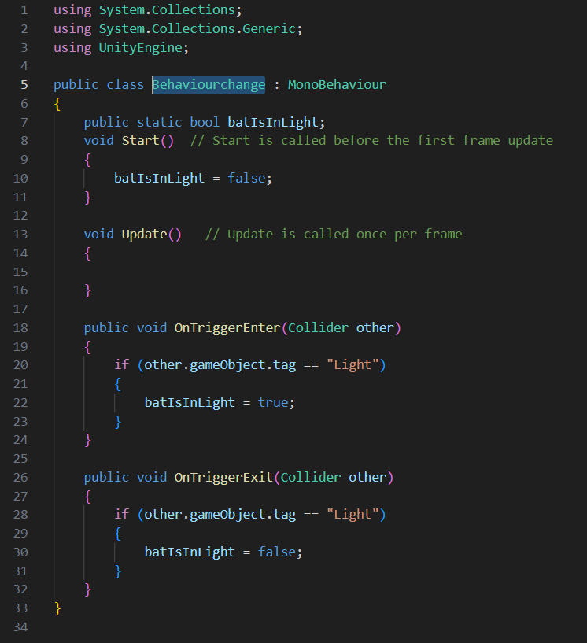

The `FlyingBat.cs` script controls flight behavior with **two sets of coroutines**:
- **Normal behavior**: `changemovespeedN()` and `changerotationN()` — random, calm movement
- **Light-affected behavior**: `changemovespeedA()` and `changerotationA()` — erratic, aggressive movement

### Code Implementation

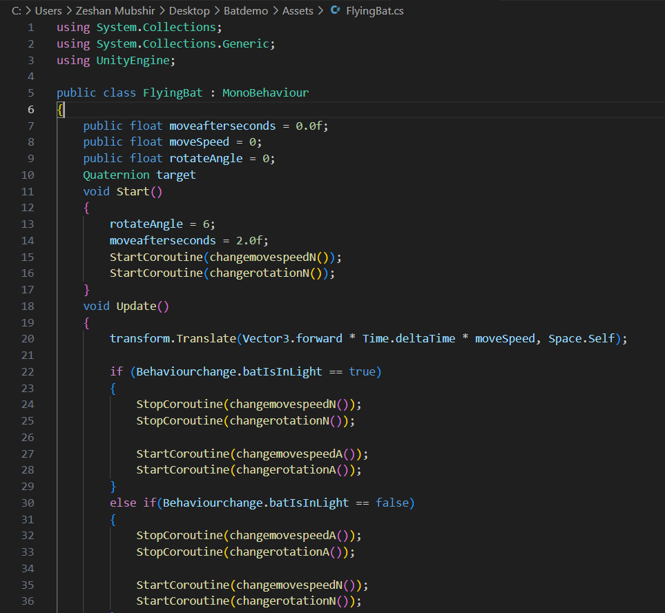
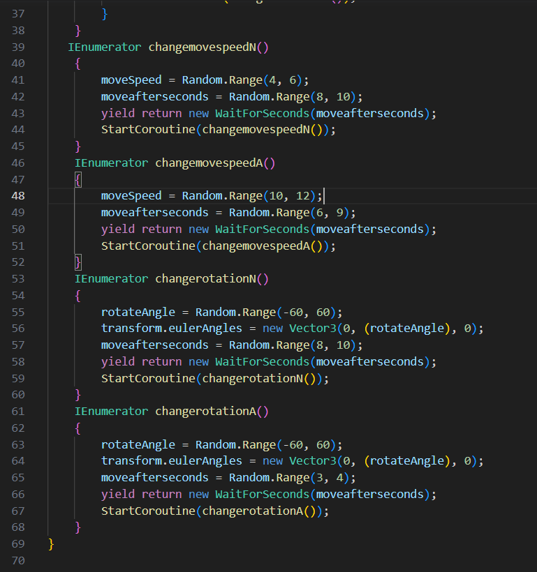

### Oculus Integration

Oculus Integration package v15_0 was connected with Meta Quest 2. A **teleportation technique** was implemented using the right controller "A" button — a raycast determines the destination and repositions the user.

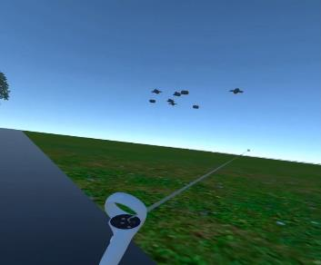

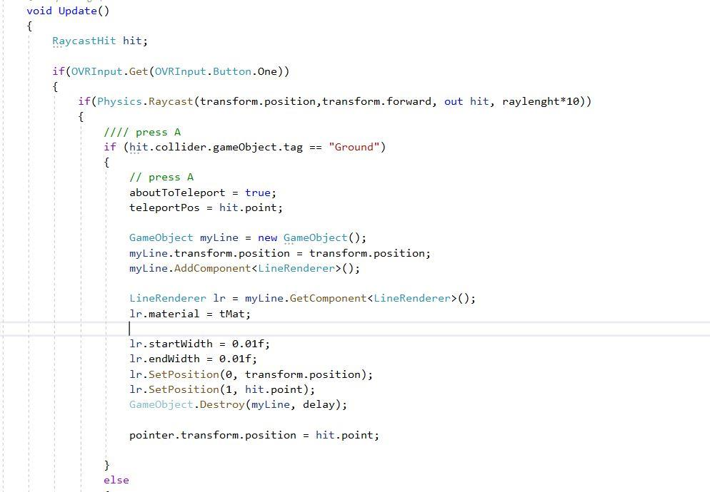

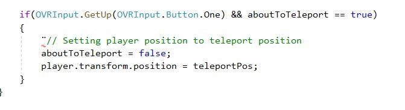

---

## More Than Human Design

The core design philosophy: **let humans experience wildlife impact firsthand**.

- Users can observe bat behavior from the animal's perspective
- Lighting designers can test configurations before deploying real infrastructure
- The experience bridges the gap between human development and environmental awareness

---

## Technologies Used

| Technology | Purpose |
|------------|---------|
| **Unity 3D** | Game engine for VR environment |
| **C#** | Scripting language for game logic |
| **Meta Quest 2** | VR headset for immersive experience |
| **Oculus Integration v15_0** | VR SDK for Unity |
| **Blender** | 3D modeling |
| **Adobe Photoshop** | Texture creation |

---

## Project Structure

```
Assets/
├── Animation/              # Bat flight animations
├── Material/               # Materials (bat, grass, road, tree, water)
├── Materials/              # Additional materials
├── Oculus/                 # Oculus Integration SDK
├── PROMETEO - Car Controller/  # Vehicle controller (reference)
├── Prefabs/                # Prefab assets
├── RTP Vol.1/              # Terrain rendering package
├── Resources/              # Runtime-loadable resources
├── Scenes/                 # Unity scenes
├── Script/                 # Pathfollow.cs, Trigger.cs
├── StreetLightsPack/       # Street light assets
├── Texture/                # Textures (ground, lake, etc.)
├── XR/                     # XR configuration
├── BatsInstantiate.cs      # Bat spawning logic
├── Behaviourchange.cs      # Light zone detection
├── Camercontroller.cs      # Camera control
├── FlyingBat.cs            # Bat flight behavior
├── MasterController.cs     # Main scene controller
├── Objectinstantiator.cs   # Object spawning
├── Pickuplight.cs          # Light interaction
├── Teleporter.cs           # VR teleportation
├── Bat.controller          # Animator controller
└── bat.anim                # Bat animation
Packages/
├── manifest.json           # Unity package dependencies
└── packages-lock.json      # Lock file
ProjectSettings/            # Unity project configuration
```

---

## Getting Started

### Prerequisites
- Unity 2021.3+ (LTS recommended)
- Meta Quest 2 headset
- Oculus app installed on your phone and PC

### Setup
1. Clone this repository:
   ```bash
   git clone https://github.com/ZeshanMubashir/Immersive-Technologies.git
   ```
2. Open the project folder in Unity Hub
3. Let Unity import all packages and assets
4. Connect your Meta Quest 2 via USB or Wi-Fi
5. Open the main scene from `Assets/Scenes/`
6. Click **Play** to test in the headset

### VR Controls
- **Right Controller "A" Button** — Teleport to pointed location
- **Joystick** — Move around the scene
- **Look around** — Observe bat behavior from different angles

---

## Simulation & Visualization Techniques

1. **3D Modeling** — Immersive environment with terrain, water, and vegetation
2. **Texture Mapping** — Realistic ground and lake surfaces
3. **Animation** — Bat flight with behavioral variation
4. **Interactive Features** — Runtime light pole placement and bat count adjustment

---

## Challenges Faced

- Unity 3D setup for VR device integration
- Creating a realistic natural environment
- Designing user-friendly UI for immersive experience
- Modeling bat behavioral changes accurately based on research

---

## Future Extensions

1. **Multi-species study** — Simulate different bat species under various street light types (LED, fluorescent, metal halide, induction)
2. **Behavioral comparison** — Compare feeding, mating, and commuting changes across species
3. **Weather effects** — Add temperature, humidity, and wind variables
4. **Lighting designer tool** — Plan urban lighting with wildlife impact awareness

---

## References

1. [Impact of artificial lighting on bat commuting patterns](https://www.sciencedirect.com/science/article/pii/S0960982209011932) — *Current Biology*
2. [Impacts of artificial lighting on bats: challenges and solutions](https://www.researchgate.net/publication/272889669_Impacts_of_artificial_lighting_on_bats_A_review_of_challenges_and_solutions)
3. [Comparison of bat species behavioral changes under light pollution](https://www.sciencedirect.com/science/article/abs/pii/S0269749119315210)


